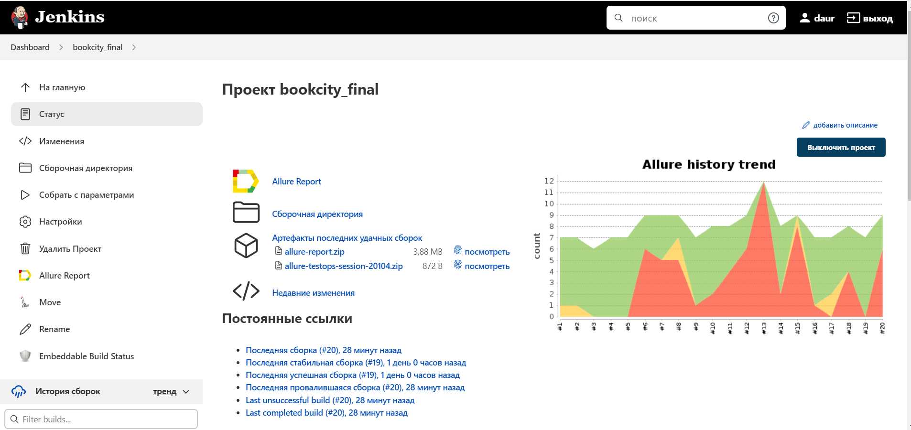

# Проект по автоматизации тестирования интернет-магазина [Книжный город](https://www.bookcity.kz/)


##	Содержание

- [Технологии и инструменты](#технологии-и-инструменты)
- [Реализованыe проверки](#реализованные-проверки)
- [Запуск тестов из терминала](#запуск-тестов-из-терминала)
- [Запуск тестов в Jenkins](#-запуск-тестов-в-jenkins)
- [Отчет о результатах тестирования в Allure Report](#-отчет-о-результатах-тестирования-в-Allure-report)
- [Интеграция с Allure TestOps](#-интеграция-с-allure-testops)
- [Интеграция с Jira](#-интеграция-с-jira)
- [Уведомления в Telegram с использованием бота](#-уведомления-в-telegram-с-использованием-бота)
- [Пример запуска теста в Selenoid](#-пример-запуска-теста-в-selenoid)

## Технологии и инструменты

<p  align="center">


</p>

## Реализованные проверки:

- [x] *Проверка логотипа*
- [x] *Проверка функции поиска по тексту*
- [x] *Проверка успешного перехода по рекламному баннеру*
- [x] *Проверка пустого поля для email*
- [x] *Проверка перехода на страницу "О компании"*
- [x] *Проверка функции добавления товара в Избранные*
- [x] *Проверка удаления товара из Избранных*

## Запуск тестов из терминала:

### Локальный запуск тестов

```bash
gradle clean test
```

### Удаленный запуск тестов

```bash
gradle clean test

-Dbrowser=${browser}
-DbrowserVersion=${browserVersion}
-DbrowserSize=${browserSize}
-DremoteUrl=${remoteUrl}
-Dthreads=${THREADS}
```

### Параметры запуска

<code>browser</code> – браузер, в котором будут выполняться тесты (_по умолчанию - <code>chrome</code>_).

<code>browserVersion</code> – версия браузера (_по умолчанию - <code>100</code>_).

<code>browserSize</code> – размер окна браузера, в котором будут выполняться тесты (_по умолчанию - <code>1920x1080</code>_).

<code>remoteURL</code> - адрес удаленного сервера, где будут запускаться тесты.

<code>threads</code> - количество потоков для многопоточного запуска (_по умолчанию - <code>5</code>_).

## Запуск тестов в [Jenkins](https://jenkins.autotests.cloud/job/bookcity_final/)

#### Главная страница Jenkins

<p align="center">
  
</p>


